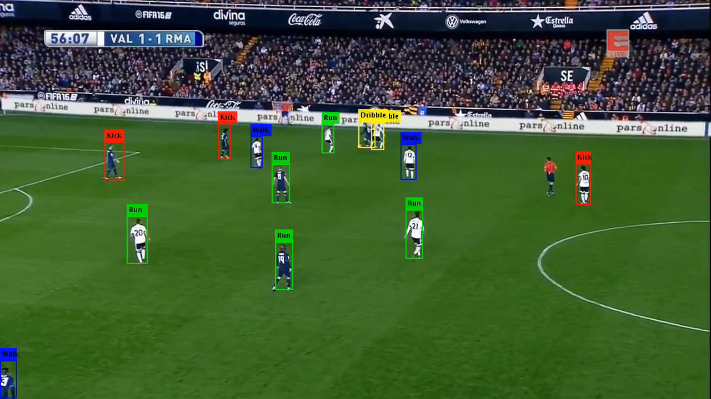

# Player-Action-Detection
## Abstract 
Human action recognition is an important research area in the field of computer vision having a great number of real-world applications.This project presents soccer player action recognition framework that extracts player silhouette clues, analyzes scene dynamics and interprets player behaviors. Different features have been considered forthe player action recognition, some of them concerning the player silhouette analysis, and some others related to the player kinematics.Experiments were carried out on a multi view image sequences of a self created soccer action dataset.

## Introduction
 Human action recognition is considered an important problem in the field of computer vision and the ever growing interest in it is fueled, in the great number of the real-world applications such as surveillance scenarios, content-based image retrieval, human-robot interaction,sport video analysis etc. This project work can be widely used in the different domains and categories. Action primitives are atomic movements that considers action primitive, action and activity. Activity contains a numbers of actions and provide an interpretation of movements that is beings performed. A video sequence is represented as the a collection of spatial-temporal words by extracting space time interest points. In order to capture the imaging variation and attributes.of individuals, two types of features are fused for the local spatial-temporal volume.

The majority of existing frameworks for action recognition consist of three main steps: feature extraction, dictionary learning to form a representation for a video based on the extracted features, and finally classification of th video using the representation. These features are supposed to encode the information which is useful for recognition of the action in a numerical form such as a vector. Then, the extracted features are used for forming a representation of a video, which captures the actions that occur therein. Such representation may be as simple as a histogram of most frequent motions or a semantically meaningful model such as action poses. Automated methods for the sports video understanding can help us in the localization of the salientactions of a game. Many recent methods exits to solve generic human activity localization in the video focusing on sport. However, detecting soccer actions is a difficult task due to sparsity of the events in the video.

## Here are the some screenshort given for the demostration purpose

